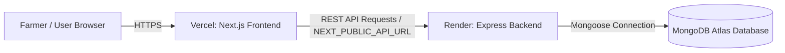

# 🚀 Annadata (अन्नदाता) Production Deployment Guide

This guide walks you through deploying **Annadata** in under 5 minutes:
1. **Backend REST API + MongoDB** on [Render](https://render.com)
2. **Frontend Next.js App** on [Vercel](https://vercel.com)
3. **Database** on [MongoDB Atlas](https://www.mongodb.com/atlas) (Free Tier M0)

---

## 📋 Architecture Overview



---

## Step 1: Set Up Free MongoDB Database (MongoDB Atlas)

1. Go to [MongoDB Atlas](https://www.mongodb.com/atlas) and sign in or create a free account.
2. Click **Create Deployment** $\rightarrow$ select the **M0 Free Tier** cluster.
3. Under **Security Quickstart**:
   - Create a database user (e.g. `annadata_admin` and set a secure password).
   - Under **IP Access List**, select **Allow Access from Anywhere** (`0.0.0.0/0`) so Render instances can connect.
4. Click **Database** $\rightarrow$ **Connect** $\rightarrow$ **Drivers** (Node.js).
5. Copy your connection string:
   ```env
   mongodb+srv://<username>:<password>@cluster0.abcde.mongodb.net/annadata?retryWrites=true&w=majority
   ```
   *(Replace `<username>` and `<password>` with your actual DB user credentials).*

---

## Step 2: Deploy Backend to Render

### Option A: Using Blueprint (Recommended)
1. Go to [Render Dashboard](https://dashboard.render.com).
2. Click **New +** $\rightarrow$ **Blueprint**.
3. Connect your repository: `https://github.com/Aastha1804Chaadokar/Annadata.git`.
4. Render will automatically detect `render.yaml`.
5. Enter the `MONGODB_URI` value you copied from MongoDB Atlas.
6. Click **Apply**.

### Option B: Manual Web Service Setup
1. Go to **Render Dashboard** $\rightarrow$ **New +** $\rightarrow$ **Web Service**.
2. Select your repository: `Aastha1804Chaadokar/Annadata`.
3. Configure the service:
   - **Name**: `annadata-backend`
   - **Region**: Singapore or Frankfurt (or nearest to your users)
   - **Root Directory**: `backend`
   - **Runtime**: `Node`
   - **Build Command**: `npm install && npm run build`
   - **Start Command**: `node dist/index.js`
   - **Instance Type**: `Free`
4. Add **Environment Variables**:
   | Key | Value |
   | :--- | :--- |
   | `NODE_ENV` | `production` |
   | `CORS_ORIGIN` | `*` *(or your Vercel URL later)* |
   | `MONGODB_URI` | `mongodb+srv://...` *(from Step 1)* |
5. Click **Create Web Service**.
6. Once deployed, copy your Render URL (e.g. `https://annadata-backend.onrender.com`).
7. Test the health endpoint: `https://annadata-backend.onrender.com/api/v1/health` $\rightarrow$ should return `{"status":"ok"}`.

---

## Step 3: Deploy Frontend to Vercel

1. Go to [Vercel Dashboard](https://vercel.com/dashboard) and sign in.
2. Click **Add New...** $\rightarrow$ **Project**.
3. Import your GitHub repository: `Aastha1804Chaadokar/Annadata`.
4. Configure Project Settings:
   - **Framework Preset**: `Next.js`
   - **Root Directory**: Click `Edit` and select `web`
   - **Build Command**: `npm run build` (Default)
   - **Output Directory**: `.next` (Default)
   - **Install Command**: `npm install` (Default)
5. Expand **Environment Variables** and add:
   | Key | Value |
   | :--- | :--- |
   | `NEXT_PUBLIC_API_URL` | `https://annadata-backend.onrender.com/api/v1` *(your Render URL + /api/v1)* |
6. Click **Deploy**.
7. In ~60 seconds, your website will be live at `https://annadata-xxx.vercel.app`! 🎉

---

## Step 4: Verification Checklist

| Test Item | Verification URL / Action | Expected Result |
| :--- | :--- | :--- |
| **Backend Health** | `https://<render-url>/api/v1/health` | `{"status":"ok", "timestamp":"...", "database":"connected"}` |
| **Root Welcome** | `https://<render-url>/` | Returns JSON status and list of API endpoints |
| **Homepage UI** | `https://<vercel-url>/` | 17-section full-screen interactive editorial design loads instantly |
| **Farmer Login** | `https://<vercel-url>/login` | Log in with mobile number (persists session & connects to DB) |
| **Soil Health Test** | `https://<vercel-url>/app/soil` | Enter NPK/pH values $\rightarrow$ instant scientific analysis & save |
| **Crop Recommendation**| `https://<vercel-url>/app/crop-recommendation` | Crop ranking algorithm outputs best-fit crops |
| **Farm Geocoding** | `https://<vercel-url>/farm-location` | GPS geolocation & reverse geocoding pinpoints exact village/district |
| **Multilingual** | Language Selector | Seamless real-time translation across 7 Indian languages |

---

## 🛠️ Local Development

To run the full stack locally:

```bash
# 1. Start MongoDB daemon locally (port 27017)
# 2. Start backend REST API (port 5000)
npm run backend:dev

# 3. Start Next.js web application (port 3000)
npm run web:dev
```
